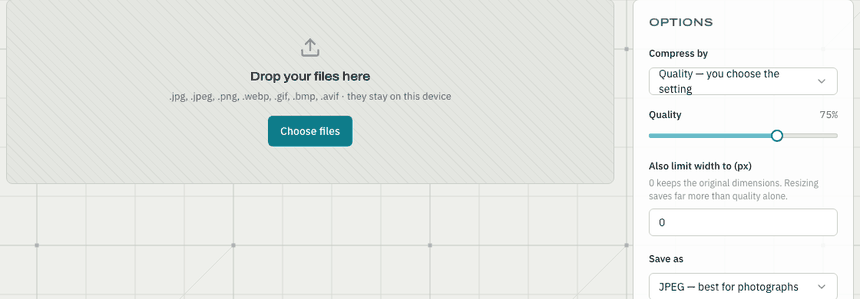
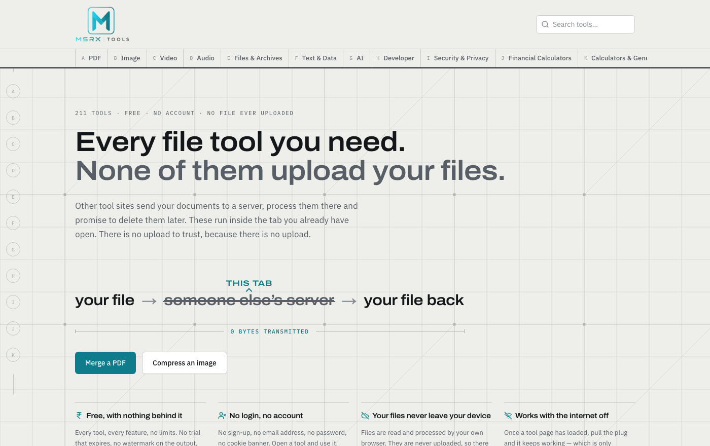
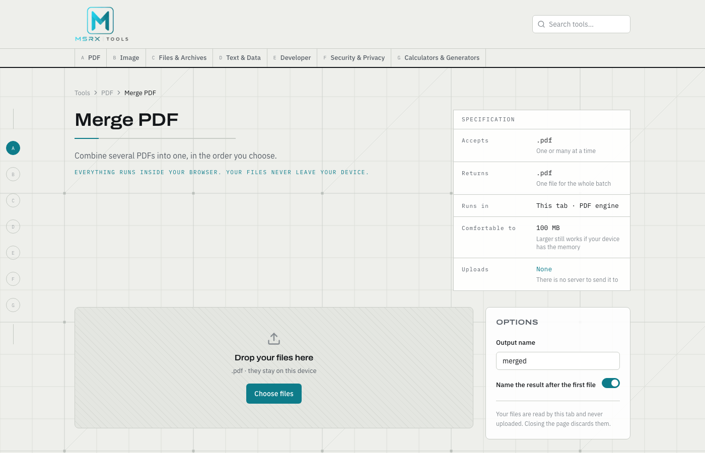

# MSRX Tools

**[tools.msrx.co.in](https://tools.msrx.co.in)** — 211 tools for files, images, video, audio, text, money and code. Almost all of them run entirely in your browser.

No account, no quota, no paid tier. Open the site in a private window and every tool works.

**No file is ever uploaded.** Every tool that touches a file — PDF, image, video, audio, archive, encryption — reads it on your device and never transmits it. The 24 AI writing tools are the one exception, and they say so on their own pages: they take typed text, never a file, and send that text to a model. Everything else keeps working with the network off.



*A real 2.53 MB JPEG, compressed to 1.17 MB. The network tab stays empty the entire time.*



## Why it's built this way

Most "free online tools" are upload forms. Your file goes to someone's server, gets processed, and you take their word for what happened to it afterwards. That is a bad trade for a file you only wanted to rename.

So for anything file-shaped the constraint is architectural, not a promise: the work happens in the page. PDFs go through `pdf-lib` and `pdfjs-dist`, archives through `fflate` (plain JavaScript deflate, not WASM, so it works on a phone and offline), video and audio through the codecs the browser already ships, encryption through the Web Crypto API. There is no endpoint to send a file to, because none exists.

## What's in it

211 tools across 11 categories, counted from the registry rather than typed into this sentence:

| Category | Tools |
|---|---|
| Financial | 34 |
| Text | 30 |
| Developer | 28 |
| AI writing | 24 |
| Video | 21 |
| PDF | 19 |
| Security | 18 |
| Image | 15 |
| Calculators | 11 |
| Audio | 8 |
| Files & archives | 3 |

## How it's structured

Every tool is one `ToolSpec` in `src/lib/tools/catalog/` and one content entry beside it. The registry in `src/lib/tools/registry.ts` is the single source of truth — routing, navigation, search, the sitemap, the internal link matrix and the smoke tests all read from it. Adding a tool means adding data, not wiring.

Execution is separated from description. A `ToolSpec` names an engine and an operation; the engines in `src/lib/engines/` (`pdf`, `image`, `archive`, `crypto`, `pure`) do the work and know nothing about pages or routing.

Every tool page renders its specification straight from that data — what it accepts, what it returns, where it runs, and what it uploads:



Two build gates worth knowing about:

- **`check:content --strict`** runs in `prebuild`, so a tool added without its written page fails the build. It checks for *reuse* rather than word count — no sentence or eight-word phrase may repeat across pages — because filler is long by nature and length proves nothing. It caught four self-plagiarised sentences mid-write and four defects in pages that had already shipped.
- **449 tests across 16 files**, including an option-contract suite that exists because of a real bug class: a dropdown that silently changed what its neighbours *meant* without changing them. Three tools were affected.

## Stack

Next.js 16 · React 19 · TypeScript · Tailwind v4 · Radix UI · Zustand · pdf-lib · pdfjs-dist · fflate · Web Crypto

The AI writing tools and the optional per-tool assistant call Groq. The key is server-side only and never reaches the browser; every file tool works with the assistant switched off, and offline.

## Running it

```bash
npm install
npm run dev
```

`npm test` runs the suite, `npm run typecheck` the types, `npm run check:content:strict` the content gate.

## Licence

No licence is granted. The source is public to read, not to redistribute.
